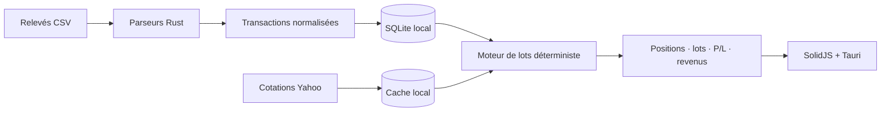

<div align="center">
  

<h1>Suivi des ordres</h1>

<p>
    <strong>La performance réelle de vos investissements.<br>Chaque euro expliqué.</strong>
  </p>

<p>
    
    
    
    
    
  </p>
</div>

---

**Suivi des ordres** consolide les relevés de plusieurs courtiers et reconstruit
le portefeuille lot par lot. L'application sépare les achats, les ventes, les
frais, les dividendes, le staking et les transferts pour montrer d'où vient
réellement la performance — sans rendement approximatif ni mouvement inventé.

> Un total n'est utile que si l'on peut remonter jusqu'à chaque ordre qui
> l'explique.

## Ce que l'application fait vraiment

|    | Fonction                                  | Résultat                                                                    |
| -- | ----------------------------------------- | --------------------------------------------------------------------------- |
| 🧾 | **Un achat = un lot**                     | Chaque prix, date, quantité et frais reste consultable séparément.          |
| 📉 | **Ventes en FIFO**                        | Le coût de revient et la plus-value réalisée sont reconstruits lot par lot. |
| 💸 | **Frais au prorata**                      | Une vente partielle ne fausse pas le capital encore investi.                |
| 🔁 | **Transferts sans faux achat**            | Le lot conserve son historique lorsqu'il change de courtier.                |
| 🪙 | **Staking reconnu comme revenu**          | Les micro-versements sont regroupés et séparés de la variation du cours.    |
| 💶 | **Réalisé, latent et dividendes séparés** | Aucun chiffre global ne masque la nature du gain ou de la perte.            |
| 📴 | **Fonctionnement local et hors ligne**    | Transactions, calculs et cache de cotations restent sur l'appareil.         |

### Des calculs lisibles

```text
Valeur de marché  = quantité restante × dernier cours
Capital de référence = coût restant des lots + frais d'achat alloués
P/L latent        = valeur de marché − capital de référence
P/L réalisé       = produit net de vente − coût FIFO des quantités vendues
```

Les montants sont calculés avec des nombres décimaux, pas avec des flottants. Si
une cotation manque ou si l'historique est incohérent, l'application le signale
au lieu de fabriquer une valeur.

### Le cas particulier du staking

Une récompense de staking n'est **pas un achat**. Sa valeur au moment de la
réception est comptée comme un dividende en nature. Le P/L affiché sur le lot de
staking représente seulement la variation du cours depuis cette réception :

```text
Contribution économique = revenu reçu + variation depuis la réception
```

Ainsi, un lot de staking momentanément en baisse ne signifie pas que l'ensemble
du revenu reçu est une moins-value.

## Imports pris en charge

Le format du fichier est détecté automatiquement.

| Source                                 | Opérations reconnues                                                        | Compte |
| -------------------------------------- | --------------------------------------------------------------------------- | ------ |
| **Trade Republic**                     | Achats, ventes, frais, taxes, dividendes, staking et attributions gratuites | CTO    |
| **Bourse Direct**                      | Achats, ventes, coupons, transferts et mouvements annexes                   | PEA    |
| **Yahoo / BoursoBank** `portfolio.csv` | Lots d'achat historiques et cotations présentes dans l'export               | PEA    |

Les imports sont idempotents : réimporter le même relevé ne duplique pas les
transactions. Un rapport détaille les nouvelles lignes, les doublons et les
éventuelles anomalies détectées.

## Une découverte immédiate

Au premier lancement, l'application crée un petit portefeuille de démonstration
avec des actions, des dividendes, du Solana et plusieurs récompenses de staking.
Les exemples sont clairement identifiés et peuvent être supprimés en un clic,
sans toucher aux imports personnels. Une fois supprimés, ils ne réapparaissent
pas.

L'interface est responsive, pensée pour le bureau comme pour un grand écran de
smartphone, avec zones tactiles, navigation compacte et prise en charge des
zones sûres d'iOS.

## Architecture



- **Frontend :** SolidJS, TypeScript et Vite
- **Application native :** Tauri 2
- **Moteur financier :** Rust et `rust_decimal`
- **Persistance :** SQLite embarqué
- **Cotations :** actualisation Yahoo avec repli sur le cache local

## Lancer le projet

### Prérequis

- Deno 2
- Rust stable
- Les dépendances système nécessaires à Tauri 2

### Bureau

```sh
git clone git@github.com:Akmot9/actions_true_perf.git
cd actions_true_perf
deno install
deno task tauri dev
```

Le serveur Vite utilise le port `1430`. Si une ancienne instance occupe déjà ce
port, fermez-la avant de relancer la commande.

### Émulateur Android

Android demande en plus Android Studio, le SDK/NDK Android, un JDK 17 et un AVD
démarrable. L'initialisation n'est nécessaire qu'une fois :

```sh
deno task tauri android init --ci
deno task tauri android dev Pixel_8_Pro_API_35
```

Remplacez `Pixel_8_Pro_API_35` par le nom de votre émulateur si nécessaire.

### Vérifications

```sh
deno task build
cargo test --workspace --manifest-path src-tauri/Cargo.toml
```

## Documentation produit

Le [catalogue des features et user stories](./docs/features/) documente le
comportement livré et ses critères d'acceptation : imports, rapprochement des
instruments, moteur de lots, transferts, staking, performance, cotations,
édition et diagnostics.

Le guide [Déployer sur l’App Store sans Mac](./docs/deploiement-app-store.md)
explique la signature, les secrets GitHub, le build iOS sur CI et l’envoi vers
TestFlight.

## Principes du projet

- **Explicable :** chaque total doit pouvoir être justifié par les opérations
  sources.
- **Déterministe :** le même historique produit toujours le même portefeuille.
- **Prudent :** une donnée absente reste absente ; elle n'est pas devinée.
- **Local-first :** les relevés personnels et la base restent sur l'appareil.
- **Réversible :** un ordre corrigé conserve sa version importée et peut être
  restauré.

---

<div align="center">
  <strong>Pas de performance magique. Juste les vrais mouvements, les vrais frais et les vrais calculs.</strong>
  <br><br>
  <sub>Outil de suivi informatif — il ne constitue pas un conseil financier ou fiscal.</sub>
</div>
